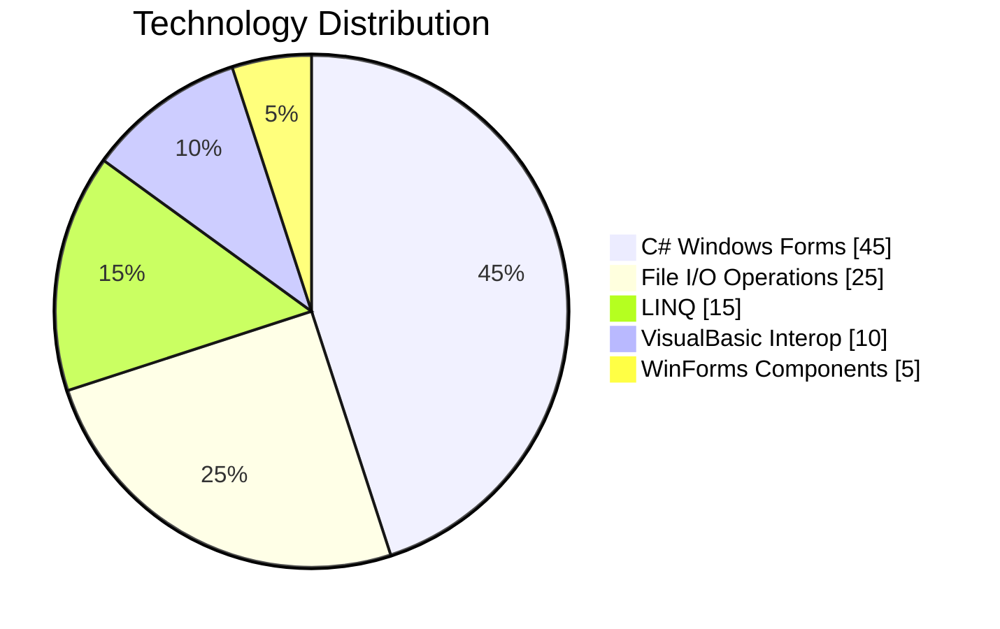

# 🎯 TaskMate - Smart To-Do List Application

  
*A C# Windows Forms application for efficient task management*

## ✨ Features

### 📅 Daily Task Management
- 🗓️ Organize tasks by day of the week (Sunday to Saturday)
- ➕ Add new tasks with due dates
- ✅ Mark tasks as completed
- 🗑️ Delete unwanted tasks

### 📊 Visual Progress Tracking
- 🔄 Progress bars for each day
- 😊 Emoji mood indicators based on completion:
  - 😃 Happy (99% complete)
  - 😌 Chill (50% complete)
  - 😴 Sleepy (0% complete)
  - 🎉 Mission Complete! (100% complete)

### 🖥️ Clean Interface
- 📋 Dual-column display (Pending/Completed)
- 🎨 Consistent formatting for easy reading
- 🔍 Quick task search functionality

## 🛠️ Technical Implementation

### 🧰 Technologies Used

| Category        | Technologies                                                                 |
|-----------------|------------------------------------------------------------------------------|
| **Core**        |  |
| **GUI**         |  |
| **Data**        |  |
| **Dependencies**|  |

<!-- ADDED -->
### 🧩 Key Concepts Implemented

**Object-Oriented Programming**
- Separation of concerns between forms and task management  
- Class-based architecture (`cfrmToDoList`, `cfrmTaskInput`, `cTaskManagment`)  

**GUI Components**
- `TabControl` for day navigation  
- `RichTextBox` for formatted task display  
- `PictureBox` for visual feedback  
- `ProgressBar` for completion tracking  

**File Handling**
- Custom text file format for task persistence  
- Line-by-line processing of task data  

**Event-Driven Programming**
- Button click handlers  
- Tab selection changes  
- Form load events  

**Data Formatting**
- String manipulation for consistent display  
- Date parsing and formatting  


### 📊 Technology Distribution



### 🏗️ Architecture
```mermaid
graph TD
    A[Main Form] -->|Uses| B[Task Input Form]
    A -->|Manages| C[Task Management Class]
    C -->|Reads/Writes| D[TaskTracker.txt]
    A -->|Displays| E[RichTextBox Controls]
    A -->|Shows Progress| F[Progress Bars]
    A -->|Visual Feedback| G[Emoji Images]

